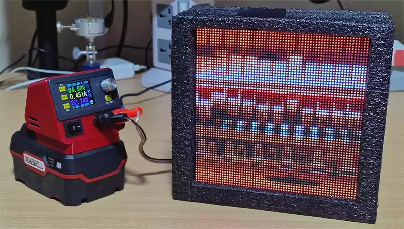

This app retrieves the 'now playing' track from your SubSonic API based music server, and displays it to a Flaschen-Taschen RGB matrix display. It should be compatible with music servers that implement Subsonic API compatibility, including Jellyfin, Airsonic and Navidrome.

It can also use the LastFM API to cross-reference your now playing tracks to increase accuracy ([see below](#why-use-the-lastfm-api-in-addition-to-subsonic-api) for details).

If you would prefer a version of this app that queries LastFM only (and thus would be compatible with any music player that scrobbles, including [Spotify](https://community.spotify.com/t5/FAQs/How-can-I-connect-Spotify-to-Last-fm/ta-p/4795301)), [check this repo](https://github.com/telekineticyeti/lastfm-nowplaying-rgb-display/).


_Raspberry Pi zero 2 powered 64x64 RGB display in prototype case, showing album art from LastFM API_

# Configuration

Configuration parameters are applied using environment variables. You can provide these as a `.env` file in the project folder, or as variables in docker (recommended).

The following is a list of variables and their default values:

```bash
# Optional - defaults to false. Set `true` to enable debug console output.
CLIENT_DEBUG=true

# The frequency that the LastFM API is queried for updates.
# Ideally this would be a lesser value than the `--layer-timeout` parameter value set on your Flaschen-Taschen server.
# Optional - defaults to 10 seconds.
POLLING_FREQUENCY_SECS=10

# The host/ip address of your Flaschen-Taschen server
FLASCHEN_TASCHEN_HOST=my_ft_server_ip_or_hostname

# The port of your Flaschen-Taschen server
# Optional - defaults to 1337
FLASCHEN_TASCHEN_PORT=1337

# The width of your Flaschen Taschen Display (or the width that you want the image to be)
# Optional - defaults to 32
FLASCHEN_TASCHEN_WIDTH=64

# Image height
# Optional - defaults to 32
FLASCHEN_TASCHEN_HEIGHT=64

# Subsonic Server host
SUBSONIC_SERVER_HOST=your_subsonic_server_hostname

# Subsonic Server username
SUBSONIC_SERVER_USER=your_subsonic_server_username

# Subsonic Server password
SUBSONIC_SERVER_PASS=your_subsonic_server_password

# OPTIONAL: The LastFM username to query for now playing
LASTFM_USER=my_last_fm_username

# OPTIONAL: Your API key for Last FM
# https://www.last.fm/api/account/create
LASTFM_APIKEY=my_last_fm_api_key
```

Note that to enable LastFM queries, both `LASTFM_USER` and `LASTFM_APIKEY` must be defined.

# Deployment

This app can be launched using any of the following methods below.

## Docker-compose (recommended)

Use the [`docker-compose.yaml` configuration](https://github.com/telekineticyeti/subsonic-nowplaying-rgb-display/blob/master/docker-compose.yaml) provided in this repo to pull, build and deploy this app with docker-compose.

## Build and run with Docker

Configuration is provided via `-e` flags in docker create command.

```bash
# Either clone the repo and build the image
docker build . -t subsonic-nowplaying-rgb-display
# Alternatively, build the image directly from this repo url
docker build https://github.com/telekineticyeti/subsonic-nowplaying-rgb-display

# Create the container using the above image, with absolute minimal configuration
# (32x32 display, 10 second API polling frequency - see configuration above)
docker create \
 --name=subsonic-nowplaying \
 -e FLASCHEN_TASCHEN_HOST=192.168.0.100 \
 -e LASTFM_USER=your-lastfm-user-name \
 -e LASTFM_APIKEY=your-lastfm-api-key \
 -e SUBSONIC_SERVER_HOST=your-subsonic-server-hostname \
 -e SUBSONIC_SERVER_USER=your-subsonic-server-username \
 -e SUBSONIC_SERVER_PASS=your-subsonic-server-password \
 --restart unless-stopped \
 subsonic-nowplaying-rgb-display

# Start the container
docker start subsonic-nowplaying
```

## Build and run with NodeJS

Clone the repo and execute the following commands:

```bash
# Install dependencies
npm install

# Run the development server
npm run start

# Run the deployment server
npm run deploy
```

# Known issues

- For unknown reasons, the LastFM API will occasionally return a data response for an incorrect user! It will also occasionally claim that the user does not exist.
  ```bash
  Error [6]: User not found
  ```
- The LastFM API will occasionally return error code `8`
  ```bash
  Error [8]: Operation failed - Most likely the backend service failed. Please try again.
  ```

These issues are intermittent and usually resolves after the next API poll. For this reason the error throw in the `nowPlaying()` try-catch was removed so that the app does not exit.

---

# Why use the LastFM API in addition to Subsonic API?

Unfortunately, accurately determining the 'now playing' track on Airsonic is not as straight forward as one would think! I ran into several challenges determining what the actual 'now playing' track is due to a combination of the following:

- The Airsonic/Airsonic Advanced implementations of [Subsonic API](http://www.subsonic.org/pages/api.jsp) will return a non-ordered array of 'recent tracks' instead of what is now actually playing. These tracks have a `minutesAgo` property that _could_ allow us to deduce which track is most recent, however...
- Navidrome will return an ordered array of tracks, with the most recent track being the first item. This is more ideal than Airsonic's, approach, however tracks that are no longer playing will persist in the API response for up to 20 minutes after the track is no longer playing.
- my client of choice ([Sonixd](https://github.com/jeffvli/sonixd)) will download and cache two tracks in succession to support it's crossfading playback feature - The current track as well as the track that follows it. This results in two new item entries in the Subsonic API 'recent tracks' response, both of which have a `minutesAgo: 0` property. Since the array response is not ordered, so it is not possible to determine the actual currently playing track this way.

## So why not just use LastFM only?

It's certainly an option, and I made a LastFM-only version of this app [here](https://github.com/telekineticyeti/lastfm-nowplaying-rgb-display/). However I found that a lot of album art for tracks in my library are missing from LastFM or incorrect. I have a meticulous degree of control over album art on my Airsonic instance, so I'd prefer to pull art from there first.

## But I can use this without LastFM?

Yes, and for most cases this will be fine, but it's worth enabling if you run into any of the issues described above. This app is a work in progress, so any insight on improving the 'now playing' accuracy is also appreciated!

# Additional Notes

## flaschen-taschen-node

This app uses my [flaschen-taschen-node](https://github.com/telekineticyeti/flaschen-taschen-node) library to construct and send images to an FT server. It also uses my [subsonic-api-wrapper](https://github.com/telekineticyeti/subsonic-api-wrapper) library for interfacing with Subsonic-based APIs. These libraries are a work in progress and will be available by NPM as they mature. In the meantime, feel free to try them in your own projects!

## Hardware

My setup uses the following specific hardware:

- Raspberry Pi Zero 2
- [Pimeroni 64x64 RGB display](https://shop.pimoroni.com/products/rgb-led-matrix-panel?variant=3029531983882)
- [Adafruit RGB Matrix Bonnet for Raspberry Pi](https://shop.pimoroni.com/products/adafruit-rgb-matrix-bonnet-for-raspberry-pi?variant=2257849155594)

I run my F[laschen Taschen Server](https://github.com/hzeller/flaschen-taschen) with the following settings:

```bash
$ ft-server --led-rows=64 --led-cols=64 --led-brightness=60 --led-slowdown-gpio=1 --led-gpio-mapping=adafruit-hat-pwm --layer-timeout=30 --led-show-refresh
```

With the above settings I get a pretty solid refresh rate of around 112Hz. I lower the brightness of the output to 60%, to reduce overall power consumption and avoid washed-out images. A fully lit display (RGB 255,255,255 over 4096 pixels) at these settings draws around 1-1.1 amps (~5.2W).

Please note that the settings are going to vary from system-to-system and display-to-display - what works for me may not work well for you. I recommend diving into the [FT server documentation](https://github.com/hzeller/rpi-rgb-led-matrix#changing-parameters-via-command-line-flags) to tweak your own display to your liking.
